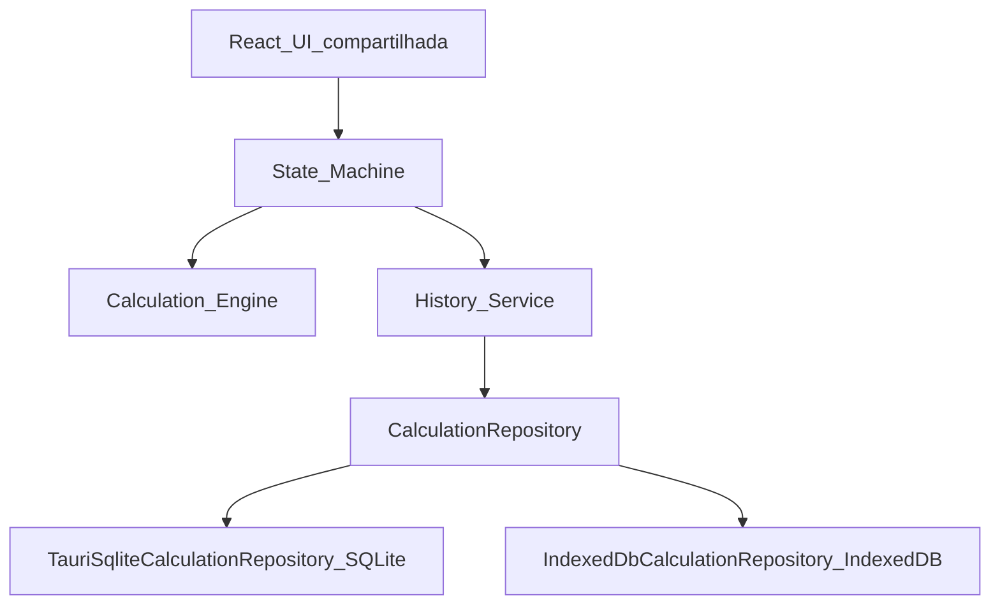

# PLAN.md — Calculadora Web + Desktop

## 1. Objetivo do produto

Aplicativo de calculadora com visual próximo ao design macOS do `design.pen`: operações aritméticas básicas, display de expressão + resultado, e histórico local persistido.

O produto final funciona em **dois ambientes** com a mesma UI e a mesma lógica:

1. **navegador web** (Vite / React);
2. **aplicativo desktop Tauri**.

## 2. Escopo da V1

- UI da calculadora básica alinhada ao frame Calculator Window.
- Operações: `+ − × ÷`, `%`, `+/−`, decimal `,`, backspace, AC, `=`.
- Entrada por teclado on-screen e teclado físico.
- Controles nativos de janela no desktop (fechar / minimizar); maximize desabilitado/inativo como no design.
- Persistência de histórico local, abstraída por `CalculationRepository`:
  - **Desktop (Tauri):** SQLite via `TauriSqliteCalculationRepository`;
  - **Web (navegador):** IndexedDB via `IndexedDbCalculationRepository`.
- **Fora da V1:** telas/fluxos completos de Convert e Keypad Mode (botões podem existir desabilitados ou como stub); UI de listagem de histórico.

## 3. Funcionalidades

- Digitar números e montar expressão no display.
- Avaliar expressão com `=`; limpar (AC) e apagar (backspace).
- Percentual e troca de sinal.
- Separador decimal `,` (locale BR no design).
- Registrar histórico de cálculos concluídos (persistência por ambiente).
- Preferências simples ficam fora da V1 (sem tabela de preferências).

## 4. Arquitetura

**Compartilhado entre web e desktop (uma única implementação):**

- React UI
- design (`design.pen` como fonte de verdade visual)
- State Machine
- Calculation Engine
- regras matemáticas
- suporte a teclado
- History Service

**Persistência:** interface comum `CalculationRepository`; seleção automática do adapter conforme o ambiente (Tauri vs. navegador).

**Regras de isolamento:**

- React não executa SQL diretamente.
- React não acessa IndexedDB diretamente.
- History Service depende somente de `CalculationRepository`.
- Calculation Engine não conhece SQLite, IndexedDB ou Tauri.
- State Machine permanece compartilhada.
- Nenhuma lógica matemática duplicada.
- Nenhuma UI duplicada.
- Falha na persistência nunca impede a calculadora de funcionar.

## 5. Módulos principais

- `ui` — janela/display/keypad/tokens do design (única UI para web e desktop).
- `calculator` — parse/avaliação, AC, backspace, `%`, sinal, erros (divisão por zero).
- `window` — traffic lights / decoração alinhada ao design (desktop Tauri; na web, representação visual conforme o design).
- `history` — History Service + `CalculationRepository`.
- `persistence/desktop` — `TauriSqliteCalculationRepository` (SQLite + migrations).
- `persistence/web` — `IndexedDbCalculationRepository` (IndexedDB).
- `persistence/factory` — seleção automática do adapter por ambiente.

## 6. Responsabilidade da persistência

- Histórico de cálculos concluídos (`expression`, `result`, `created_at`).
- Desktop: SQLite no diretório de dados do app (via Tauri).
- Web: IndexedDB no navegador (sem runtime Tauri).
- Sem sync em nuvem.
- Sem uso de persistência para o estado transitório do display (fica em memória no React / State Machine).
- Falha ao abrir/migrar/inserir/listar: log interno; cálculo e UI seguem normais.

## 7. Versões de entrega

### Web

- `npm run dev` — executa no navegador.
- `npm run build` — build de produção web.
- Funciona sem runtime Tauri.
- Histórico local via IndexedDB.

### Desktop

- Continua via Tauri.
- Persistência via SQLite.
- Mesma UI e lógica da versão web.

## 8. Estratégia de testes

- **Unitários** do motor e da State Machine (já cobertos nos BLOCOS 1–2).
- **Unitários / integração** de `HistoryService` e dos dois repositories (SQLite e IndexedDB), incluindo falha de persistência.
- **Finais (BLOCO 4):** testes web, testes Tauri, E2E, validação visual contra `design.pen`, `npm test`, `npm run build`, smoke de `npm run dev`, build desktop Tauri, preparação para deploy web.

## 9. Riscos técnicos

- Precisão / overflow em ponto flutuante vs. expectativa de calculadora.
- Locale decimal `,` vs. parse interno com `.`.
- Janela customizada (frameless + traffic lights) entre plataformas Linux/macOS/Windows.
- Paridade de comportamento do histórico entre SQLite e IndexedDB.
- Detecção correta do ambiente para escolher o adapter sem acoplar UI à plataforma.
- Convert e Keypad Mode presentes no design sem especificação de comportamento.

## 10. Decisões de produto ainda a definir

- O que faz **Convert** (moeda, unidades, etc.) e se entra em V2.
- O que é **Keypad Mode** (científica, programador, segundo layout).
- Plataformas alvo oficiais (Linux / macOS / Windows).
- Regras exatas de `%` e encadeamento de operações (já fixadas na SPEC V1; revisões futuras).
- Limite e UX do histórico (quantos itens, UI de consulta) — V1 persiste sem listagem.
- Tema único escuro vs. claro no futuro.
- Hosting / pipeline de deploy web.
