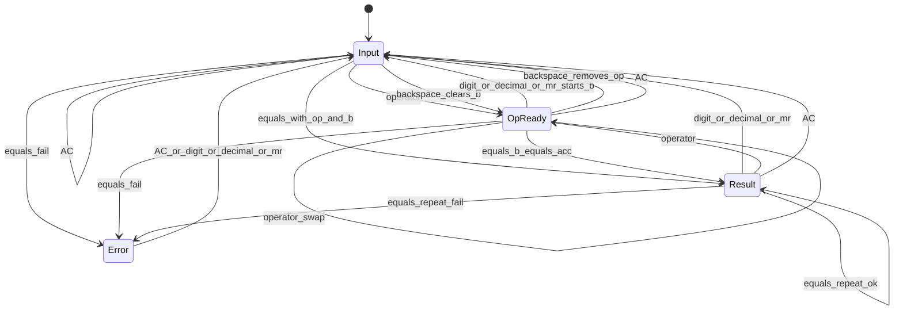

# SPEC — Calculadora Web + Desktop (V1 + Memory Controls V2)

Fontes: `PLAN.md` (escopo), `design.pen` (UI). Convert e Keypad Mode: stubs desabilitados.

Modelo: avaliação imediata estilo macOS (sem precedência de operadores). Engine TypeScript puro. Sem `eval()`.

Ambientes de entrega: **navegador web** e **aplicativo desktop Tauri**, com UI, design, State Machine, Calculation Engine, teclado e History Service compartilhados.

**V2 (Memory Controls):** registrador de sessão `memoryValue` com controles `m+`, `m-` e `mr`. Visual aprovado em `design.pen`. Sem persistência de memória. Web e Desktop usam a mesma lógica.

---

## 1. Entrada

### Números 0–9

- Cada dígito acrescenta ao operando em edição.
- Em `Result` ou `Error`, o primeiro dígito inicia novo operando (`Input`) e zera `op`/`lastB`.
- Em `OpReady`, o primeiro dígito (ou `,`) inicia o segundo operando e transiciona para `Input` com `acc`/`op` preservados.

### Separador decimal

- UI e teclado: `,` (design). Tecla `.` também insere decimal.
- No máximo um separador por operando.
- Se o operando for vazio ou só `0`, `,` produz `0,`.
- Display sempre com `,`; motor usa número interno.

### Zero à esquerda

- Inteiro: zeros iniciais colapsam para um único `0` (ex.: `0007` → `7` ao digitar `7`; enquanto só zeros, display `0`).
- Após decimal, zeros são significativos (`0,10` permitido até o limite de dígitos).

### Números negativos

- Somente via controle `+/−` (não há tecla `-` unária no keypad).
- `+/−` inverte o sinal do operando em edição (ou do resultado em `Result`).
- `-0` normaliza para `0` no display após operação que resulte em zero.

---

## 2. Controles

### AC

- Zera operando, operador pendente, último operando de repetição (`op` / `lastB` / `lastBPercent` / `percentRate`) e erro.
- Display resultado: `0`; expressão: vazia.
- Estado: `Input`.
- **`AC` NÃO apaga `memoryValue`.** A memória de sessão é independente do cálculo atual.
- Ao implementar memória, não reutilizar uma limpeza global que zere `memoryValue` acidentalmente.

Exemplo: `8` → `m+` → `AC` → `mr` → display `8`.

### Backspace

Remoção **progressiva** da entrada (comportamento oficial; a regra antiga de no-op em `OpReady` está **desatualizada** e não deve ser usada).

- Em `Input` editando um operando (com ou sem `op`/`acc`): remove o último caractere do operando em edição.
- Se o operando em edição ficar vazio após o backspace:
  - Sem operador pendente: display/`editing` ficam `0`.
  - Com operador pendente (editando `b`): remove o segundo operando e volta para `OpReady`, preservando `acc`/`op` e a expressão `"{a}{op}"` (ex.: `8+8` + Backspace → `8+`).
- Em `OpReady`: remove o operador pendente; retorna a `Input` com o operando `a` (`acc`) no display/`editing`; expressão vazia (ex.: `8+` + Backspace → `8`).
- Em `Result` ou `Error`: no-op.
- Não altera `memoryValue`.

Exemplos obrigatórios:

```text
8+8
Backspace → 8+
Backspace → 8
Backspace → 0

8+123
Backspace → 8+12
Backspace → 8+1
Backspace → 8+
Backspace → 8
Backspace → 0
```

### +/−

- Inverte sinal do valor no display (operando atual ou resultado).
- Em `OpReady` (aguardando 2º operando, display ainda mostra 1º): inverte o 1º operando (`acc`) e permanece em `OpReady`.
- Em `Error`: no-op.

### %

Porcentagem é **contextual** (estilo Calculadora macOS). Não tratar sempre como `n / 100`.

#### Sem operador pendente

- Substitui o operando atual por `n / 100`, depois formata ao display.
- Ex.: `50` + `%` → `0,5`.
- Em `OpReady` sem 2º operando iniciado: aplica ao 1º operando (`acc`/display) como `n / 100`.
- Em `Result`: aplica ao resultado como `n / 100`; limpa `op`, `lastB` e a marca de `%` (repetição de `=` deixa de valer); estado permanece `Result`.
- Em `Error`: no-op.
- Não grava histórico sozinho.

#### Com operador pendente (editando `b`)

Seja `A` o acumulador e `B` o operando em edição (taxa percentual):

| Operador | Significado de `A ⊕ B%` | Conversão de `B` no display | Exemplo |
|----------|-------------------------|-----------------------------|---------|
| `+` | `A + (A × B / 100)` | `A × B / 100` | `100 + 15 % =` → `115` |
| `−` | `A − (A × B / 100)` | `A × B / 100` | `100 - 15 % =` → `85` |
| `×` | `A × (B / 100)` | `B / 100` | `100 × 15 % =` → `15` |
| `÷` | `A ÷ (B / 100)` | `B / 100` | `100 ÷ 25 % =` → `400` |

- Ao pressionar `%`, o display/`b` passa a mostrar o valor convertido; a **taxa** `B` original fica preservada para `=` e repetição (não gravar permanentemente `+ 0,15`).
- Em `Result` após operação com `%`, `lastB` guarda a **taxa** (ex.: `15`), não só o decimal/absoluto convertido.
- Repetir `=` reaplica `A ⊕ B%` sobre o novo resultado (ex.: `100 + 15 % =` → `115`, depois `=` → `132,25`).
- Após resultado com `%`, digitar um novo número e `=` reaplica a mesma operação percentual (ex.: `100 + 15 % =` → `115`, depois `150 =` → `172,5`).
- Dígito/`,` após `Result` **sem** `%` pendente continua descartando `op`/`lastB` (comportamento normal).

### Memory Controls (V2) — `m+`, `m-`, `mr`

A calculadora possui **um** registrador numérico de memória de sessão: `memoryValue`.

| Propriedade | Valor |
|-------------|-------|
| Valor inicial | `0` |
| Escopo | sessão atual da aplicação (web ou desktop) |
| Persistência | **nenhuma** — não gravar em SQLite, IndexedDB, `CalculationRepository`, histórico ou `localStorage` |
| Reset | fechar/recarregar completamente a aplicação pode resetar `memoryValue` para `0` |
| Plataformas | mesma lógica em Web e Desktop |

`design.pen` é a fonte de verdade visual. Medidas aprovadas dos botões Memory Controls:

- tamanho `80×80`, círculo perfeito (`cornerRadius` 40)
- gap `28`, `paddingLeft` 6, `paddingBottom` 8
- labels Inter `24` / `500`; fill `$key-number`; texto `$text-primary`
- ordem: `m+`, `m-`, `mr`, alinhados às três primeiras colunas do keypad
- Calculator Window: `456×912`

Não redesenhar esses controles na implementação.

Eventos de domínio (conceituais): `memoryAdd`, `memorySubtract`, `memoryRecall`. A UI despacha eventos; a matemática e o estado ficam na State Machine / Calculation Engine — **não** no componente React.

#### `m+` (memoryAdd)

- Adiciona à memória o valor numérico efetivamente exibido: `memoryValue = memoryValue + currentDisplayValue`.
- Usa o motor existente (`add` + `roundToSignificant` / limites); **não** duplicar soma.
- **Não** altera display, expression, operador pendente, `lastB`, `%`, repetição de `=`, nem executa `=`.
- **Não** cria item de histórico.
- Em `Input`, `OpReady` e `Result`: aplica sobre o valor numérico do display.
- Em `Error` (display `Erro`): **no-op** — não altera `memoryValue` nem o estado de erro.

Exemplos:

- display `8`, `memoryValue = 0` → `m+` → `memoryValue = 8`; display continua `8`.
- `8` → `m+` → `AC` → `2` → `m+` → `memoryValue = 10`; `mr` → display `10`.

#### `m-` (memorySubtract)

- Subtrai da memória o valor numérico efetivamente exibido: `memoryValue = memoryValue - currentDisplayValue`.
- Mesmas restrições de `m+` (não altera display/expression/`=`/histórico/operação pendente).
- Em `Error`: **no-op**.

Exemplo: `10` → `m+` → `AC` → `4` → `m-` → `memoryValue = 6`; `mr` → display `6`.

#### Valor usado por `m+` / `m-`

- Sempre o valor **numérico efetivamente exibido** no momento do clique.
- Não reinterpretar `%` de novo: se o display já mostra o valor convertido, usa esse valor.
- Negativos e decimais são suportados via o mesmo engine/formatação existentes.

#### Precisão e overflow da memória

- `m+` / `m-` reutilizam `roundToSignificant`, limites numéricos e proteções contra `Infinity` / `NaN` do Calculation Engine.
- Se a operação de memória resultar em overflow ou valor inválido: **manter o último `memoryValue` válido**; não alterar display/expression; **não** entrar em `Error` por causa da memória; não crashar.
- Falha de operação de memória é isolada do cálculo principal.

#### `mr` (memoryRecall)

Injeta `memoryValue` como entrada numérica válida (formatada com o formatador do display). Respeita o estado atual. **Não** cria histórico sozinho. Se `memoryValue = 0` (nunca armazenado ou zerado), `mr` exibe `0` sem erro.

| Estado | Comportamento |
|--------|----------------|
| `Input` sem `op` | Substitui o operando em edição por `memoryValue` (não concatena). Ex.: editando `123`, `mr` com memória `8` → display/`editing` `8`. |
| `OpReady` | Equivale a iniciar o segundo operando `b` com a memória → `Input` editando `b`. Ex.: `8+` + `mr` (memória `5`) → `acc=8`, `op=+`, `editing=5`, display `5`, expression `8+`; depois `=` → `13`. |
| `Input` com `op` (editando `b`) | Substitui somente `b` pela memória; preserva `acc`/`op`. Ex.: `8+123` + `mr` (memória `5`) → `8+5`; `=` → `13`. |
| `Result` | Inicia **nova** entrada com a memória; limpa contexto de repetição de `=` (`op`, `lastB`, `lastBPercent`, `percentRate`) como nova entrada após `Result`. Ex.: após `8+2=10`, `mr` (memória `7`) → display `7` sem operação pendente. |
| `Error` | Sai do erro: display = memória formatada, estado `Input`, contexto de erro/operação anterior descartado. Ex.: `1÷0=` → `Erro`, `mr` (memória `5`) → display `5`, `Input`. |

Ao substituir o operando, `mr` limpa qualquer `percentRate` transitório do operando substituído.

#### Memória e `%`

- Nenhuma regra de porcentagem existente muda.
- `m+` / `m-` usam o valor já no display; não reinterpretam `%`.
- Todos os comportamentos atuais de `%` permanecem idênticos.

#### Memória e histórico

- `m+`, `m-` e `mr` **não** criam itens de histórico sozinhos.
- Somente `=` bem-sucedido pelas regras normais persiste histórico.
- Ex.: memória `5`, sequência `8` `+` `mr` `=` → resultado `13`; o histórico pode registrar `8+5` / `13`. Pressionar só `mr` não registra nada.

#### Memória e persistência

- Memory V2 **não** requer alteração em `CalculationRepository`, adapters SQLite/IndexedDB, migrations ou schema.
- `memoryValue` é transitório.

---

## 3. Operações

Operadores binários: `+`, `−`, `×`, `÷`.

### Símbolos na expressão

- Na linha de expressão e no histórico, usar exatamente: `+`, `-`, `×`, `÷` (menos ASCII `-`; vezes/divisão como no keypad).
- Forma: `"{a}{op}{b}"` após `=`; operandos com o mesmo formatador do display (ex.: `427+379`, `0,1+0,2`, `5×5`).

### Linha de expressão (display superior)

| Situação | Expressão | Resultado (inferior) |
|----------|-----------|----------------------|
| `Input` sem `op` | vazia | operando em edição |
| `OpReady` | `"{a}{op}"` | `a` |
| `Input` com `op` (editando `b`) | `"{a}{op}"` | `b` em edição |
| `Result` | `"{a}{op}{b}"` | resultado |
| `Error` | operação tentada (se houver) | `Erro` |

### Soma, subtração, multiplicação, divisão

- Ao pressionar operador com operando válido:
  - Se estado `Input` com `op`/`acc` e segundo operando `b` em edição → calcula `a ⊕ b`, mostra resultado, e o novo operador fica pendente sobre esse resultado (`OpReady`).
  - Se estiver em `OpReady` sem segundo operando → **troca de operador** (substitui `⊕`).
  - Se estiver em `Input` sem `op` (só um número) → guarda número e operador → `OpReady`.
  - Se estiver em `Result` → usa resultado como `a`, guarda operador → `OpReady`.

### =

- Em `Input` com `op` e `b` em edição: calcula `a ⊕ b` → `Result`; `lastB = b`.
- Em `OpReady` sem `b` iniciado (estilo macOS): `b = acc`, calcula `acc ⊕ acc` → `Result`; `lastB = acc`.
- Em `Result`: repetição (ver abaixo).
- Em `Input` sem `op`: no-op.
- Em `Error`: no-op.
- Sucesso: expressão `"{a}{op}{b}"`, persiste histórico.
- Falha: `Error`.

### Troca de operador antes do segundo operando

- Sequência `5 + −` → pendente fica subtração; display continua `5`; expressão `5-`; estado `OpReady`.

### Operações consecutivas

- `5 + 3 +` → ao segundo `+`, calcula `8`, display `8`, pendente `+`, expressão `8+`, estado `OpReady`.

### Pressionar = repetidamente

- Após `a ⊕ b =` → resultado `r`, com `op` e `lastB = b` preservados.
- Se `b` veio de `%`, `lastB` é a **taxa** percentual e cada `=` reaplica `r ⊕ lastB%`.
- Próximo `=` calcula `r ⊕ lastB` (ou `r ⊕ lastB%`), atualiza `r` e a expressão.
- Repetível indefinidamente até novo dígito/`,` (exceto após resultado com `%`, onde o novo número + `=` reaplica a operação percentual), `%` em `Result` (que limpa `lastB`), AC ou erro.

### Novo número após resultado

- Em `Result`, dígito ou `,` descarta a expressão anterior, zera `op`/`lastB`, inicia novo `Input`.

### Operador após resultado

- Em `Result`, operador usa o resultado como `a` → `OpReady`.

---

## 4. Casos especiais

### Divisão por zero

- Qualquer `÷ 0` (incluindo via `=` , `OpReady`+`=` com `b=acc`, encadeamento ou repetição) → estado `Error`.
- Display resultado: `Erro`; expressão mantém a operação tentada.
- Próximo dígito, `,` ou `AC` sai do erro.

### Precisão decimal

- Cálculo interno em IEEE-754; após cada operação binária/`%`, aplicar `roundToSignificant` antes de exibir e de encadear.
- Remover zeros à direita no display (`1,50` → `1,5`); inteiros sem vírgula (`806`).
- Sem notação científica na V1.

### 0,1 + 0,2

- Após arredondamento de display: resultado **`0,3`**.

### Arredondamento

- Half away from zero na 12ª casa significativa (ex.: `1,25` com 2 significativos → `1,3`; `-1,25` → `-1,3`).
- Aplicar antes do display e do próximo cálculo encadeado.

### Números muito grandes / overflow

- Resultado não finito (`Infinity` / `NaN`) → `Error`, display `Erro`.
- Após `roundToSignificant`, se `abs(n) >= 10^12` → `Error` (não cabe em 12 dígitos sem notação científica).
- Se a string de display (excluindo sinal e vírgula) exceder 12 dígitos → `Error`.

### Limite do display

- Máximo **12 dígitos** no operando em edição (contagem exclui sinal e vírgula).
- Dígitos extras ou segunda `,` são ignorados.

### Estados de erro

- Entrada: divisão por zero, overflow/não-finito.
- Saída: `AC` → `Input` com `0`, contexto de cálculo zerado (**`memoryValue` preservado**); dígito/`,` → `Input` com esse início e `op`/`lastB` zerados; `mr` → `Input` com `memoryValue` formatado e contexto de erro/operação descartado; demais teclas de operação: no-op até limpar (incluindo `m+` / `m-`, que não alteram `memoryValue` em `Error`).

---

## 5. Máquina de estados

### Estados

| Estado | Significado |
|--------|-------------|
| `Input` | Editando operando. Sem `op`: operando único. Com `acc`/`op`: editando o 2º operando `b` |
| `OpReady` | Operador pendente; display ainda mostra `a`; `b` ainda não iniciado |
| `Result` | Último `=` bem-sucedido (`op`/`lastB` preservados para repetir `=`) |
| `Error` | Erro de cálculo |

Contexto: `display`, `expression`, `acc`, `op`, `lastB`, `editing`, e (V2) `memoryValue` (número de sessão; default `0`). Campos de `%` existentes (`lastBPercent`, `percentRate`) permanecem.

### Transições (resumo)



Eventos:

- `digit` / `decimal` / `backspace` / `percent` / `sign` — seções 1–2.
- `memoryAdd` / `memorySubtract` / `memoryRecall` — Memory Controls (V2); `memoryAdd`/`memorySubtract` não mudam o estado da SM além de atualizar `memoryValue` (exceto no-op em `Error`).
- `operator` — seção 3 (troca e encadeamento).
- `equals` — seção 3; sucesso → `Result` + histórico; falha → `Error`.
- `clear` (AC) → `Input` com cálculo zerado; **`memoryValue` preservado**.

---

## 6. Arquitetura

```text
UI
→ State Machine
→ Calculation Engine
→ History Service
→ CalculationRepository
      ├── TauriSqliteCalculationRepository  → SQLite   (desktop)
      └── IndexedDbCalculationRepository   → IndexedDB (web)
```

| Camada | Responsabilidade |
|--------|------------------|
| **UI** | Renderiza `design.pen`; envia eventos (tecla/clique), inclusive `m+` / `m-` / `mr`; não calcula regra de negócio além de despachar eventos; **não executa SQL**; **não acessa IndexedDB**; **não** implementa soma/subtração de memória no React |
| **State Machine** | Estados/transições; monta expressão/display; chama Engine para `⊕`, `%` e operações de memória (`add`/`sub` + format); mantém `memoryValue`; **compartilhada** web/desktop |
| **Calculation Engine** | Funções puras: `add/sub/mul/div`, `percent`, `negate`, `formatDisplay`, `roundToSignificant`; **independente de React, SQLite, IndexedDB e Tauri**; sem `eval()`; **sem duplicação** de regras matemáticas (memória reutiliza `add`/`sub`) |
| **History Service** | Após `=` ok, monta `{ expression, result }` e chama `CalculationRepository`; depende **somente** dessa interface; engole/registra falha de persistência sem reverter o resultado na UI; **ignora** `m+`/`m-`/`mr` |
| **CalculationRepository** | Interface comum de persistência (`insert` / `list` / `clear`); único contrato usado pelo History Service; **sem** campo/API de memória |
| **TauriSqliteCalculationRepository** | Implementação desktop; SQLite via IPC/comandos Tauri; React não fala SQL |
| **IndexedDbCalculationRepository** | Implementação web; IndexedDB no navegador; React não acessa IndexedDB diretamente |
| **Factory de ambiente** | Seleciona automaticamente SQLite (Tauri) ou IndexedDB (browser) |

**Compartilhado (obrigatório):** React UI, design, State Machine, Calculation Engine, regras matemáticas, teclado, History Service. Nenhuma UI duplicada. `design.pen` continua sendo a fonte de verdade visual.

**Desktop:** UI/State Machine/Engine/History no TypeScript do frontend; implementação SQLite no Rust (comandos IPC) atrás de `TauriSqliteCalculationRepository`.

**Web:** mesma UI e lógica; `npm run dev` / `npm run build` sem runtime Tauri; histórico local via IndexedDB.

V1: persistir histórico sem UI de listagem. Sem tabela de preferências.

V2: `memoryValue` apenas em memória de processo/aba (State Machine); sem branches Web/Desktop para memória.

---

## 7. Persistência (`CalculationRepository`)

### Modelo lógico `calculations`

| Campo | Tipo lógico | Constraints |
|-------|-------------|-------------|
| `id` | inteiro / chave | gerado pelo storage |
| `expression` | texto | obrigatório |
| `result` | texto | obrigatório |
| `created_at` | texto | obrigatório (ISO-8601 UTC) |

- Sem linhas de erro.
- `expression` / `result` como exibidos (ex.: `427+379`, `806`; decimal com `,`).

### Desktop — SQLite

Tabela `calculations`:

| Coluna | Tipo | Constraints |
|--------|------|-------------|
| `id` | `INTEGER` | `PRIMARY KEY AUTOINCREMENT` |
| `expression` | `TEXT` | `NOT NULL` |
| `result` | `TEXT` | `NOT NULL` |
| `created_at` | `TEXT` | `NOT NULL` (ISO-8601 UTC) |

Índice:

```sql
CREATE INDEX idx_calculations_created_at ON calculations(created_at DESC);
```

Migration:

- `001_init.sql`: `CREATE TABLE calculations (...)` + índice acima.
- Aplicar na abertura do app desktop; versão em `schema_migrations(version INTEGER PRIMARY KEY)`.

### Web — IndexedDB

- Object store equivalente a `calculations` com os mesmos campos lógicos.
- Ordenação de listagem por `created_at` descendente (índice ou sort pós-leitura).
- Sem runtime Tauri.

### Falha de persistência

- Falha ao abrir/migrar/inserir/listar (SQLite ou IndexedDB): log interno; cálculo e UI seguem normais.
- Insert falho: resultado permanece na tela; item não entra no histórico.
- Sem crash do processo/aba por erro de persistência na V1.
- **Falha na persistência nunca impede a calculadora de funcionar.**
- **`memoryValue` não é persistido** (nem em falha nem em sucesso de histórico).

---

## 8. Teclado

| Tecla | Ação |
|-------|------|
| `0`–`9` | dígito |
| `+` | soma |
| `-` | subtração |
| `*` | multiplicação |
| `/` | divisão |
| `Enter` ou `=` | igual |
| `Backspace` | backspace |
| `Escape` | AC |
| `,` ou `.` | separador decimal |
| `%` | percentual |

- `+/−` apenas pelo botão da UI na V1 (sem atalho obrigatório).
- V2: `m+`, `m-` e `mr` funcionam por **clique/tap** na UI; **não** é obrigatório criar atalhos físicos nesta versão.
- Não alterar os atalhos já existentes.
- Atalhos ativos com foco na janela da calculadora.

---

## 9. Testes

| Área | O que cobrir |
|------|----------------|
| **Calculation Engine** | `+ − × ÷`, `%`, negate, `0,1+0,2` → `0,3`, ÷0, overflow `>= 10^12`, format/round 12 dígitos half away from zero |
| **State Machine** | troca de operador, encadeamento, `=` com `b=acc` em `OpReady`, `=` repetido, novo número após resultado, operador após resultado, AC, backspace progressivo (`8+8` → `8+` → `8` → `0`), `%` em `Result` limpa `lastB`, saída de `Error` |
| **Memory Controls (V2)** | ver lista obrigatória abaixo |
| **CalculationRepository (SQLite)** | migration, insert, list ordenado por `created_at`, clear; falha de insert sem throw para o caller; sem schema de memória |
| **CalculationRepository (IndexedDB)** | insert, list ordenado por `created_at`, clear; falha de insert sem throw para o caller; sem store de memória |
| **History Service** | depende só da interface; `=` sucesso → insert; `m+`/`m-`/`mr` não chamam insert; falha de persistência não altera resultado/UI |
| **Teclado** | mapa da seção 8 dispara os mesmos eventos dos botões (exceto memória, só UI) |
| **UI** | smoke: display expressão/resultado, keypad e Memory Controls; Convert/Keypad Mode desabilitados |
| **Finais web** | `npm run dev`, `npm run build`, histórico IndexedDB, app sem Tauri |
| **Finais desktop** | build Tauri, histórico SQLite, mesma UI/lógica |
| **E2E / visual** | critérios da seção 10 + Playwright (seção 11) + validação contra `design.pen` |

### Testes unitários obrigatórios — Memory Controls

1. `memoryValue` inicia em `0`
2. `8` + `m+` → `memoryValue = 8`
3. `8` `m+` / `2` `m+` → `memoryValue = 10`
4. `10` `m+` / `4` `m-` → `memoryValue = 6`
5. `5` `m-` → `memoryValue = -5`
6. `1,5` `m+` / `2,25` `m+` → `memoryValue = 3,75`
7. `m+` não altera display
8. `m-` não altera display
9. `m+` não altera expression
10. `m-` não altera expression
11. `AC` NÃO limpa `memoryValue`
12. `mr` após `AC` recupera memória
13. `mr` em `Input` substitui o operando atual
14. `mr` em `OpReady` inicia `b`
15. `mr` durante edição de `b` substitui `b`
16. `mr` após `Result` inicia cálculo novo
17. `mr` em `Error` retorna para `Input`
18. `mr` com `memoryValue` `0` funciona
19. `m+` em `Error` é no-op
20. `m-` em `Error` é no-op
21. operações de memória não criam histórico
22. overflow de `memoryAdd` mantém último `memoryValue` válido
23. overflow de `memorySubtract` mantém último `memoryValue` válido
24. `mr` limpa `percentRate` quando substitui operando

### Regressão obrigatória

Todos os testes existentes devem continuar passando. Em especial:

- `427 + 379 = 806`
- `10 − 3 = 7`
- `5 × 5 = 25`
- `10 ÷ 2 = 5`
- `0,1 + 0,2 = 0,3`
- `1 ÷ 0 = Erro`
- `5 + = 10`
- `5 + 3 =` → `8`; `=` → `11`; `=` → `14`
- `50 % = 0,5`
- `100 + 15 % = 115`
- `100 − 15 % = 85`
- `100 × 15 % = 15`
- `100 ÷ 25 % = 400`
- troca de operador; operações consecutivas; novo número após `Result`; `+/−`; `AC`
- Backspace progressivo: `8+8` → Backspace → `8+` → Backspace → `8` → Backspace → `0`

Nenhum comportamento existente pode ser enfraquecido para facilitar Memory Controls.

---

## 10. Critérios de aceitação

**427 + 379 = 806**  
Given display `0`  
When digitar `427`, `+`, `379`, `=`  
Then resultado `806` e expressão `427+379`

**10 − 3 = 7**  
Given calculadora limpa  
When `10`, `−`, `3`, `=`  
Then resultado `7` e expressão `10-3`

**5 × 5 = 25**  
Given calculadora limpa  
When `5`, `×`, `5`, `=`  
Then resultado `25` e expressão `5×5`

**10 ÷ 2 = 5**  
Given calculadora limpa  
When `10`, `÷`, `2`, `=`  
Then resultado `5` e expressão `10÷2`

**0,1 + 0,2**  
Given calculadora limpa  
When `0`, `,`, `1`, `+`, `0`, `,`, `2`, `=`  
Then resultado `0,3`

**Divisão por zero**  
Given calculadora limpa  
When `1`, `÷`, `0`, `=`  
Then estado `Error` e display `Erro`

**= em OpReady sem b**  
Given `5`, `+` (estado `OpReady`)  
When `=`  
Then resultado `10` e expressão `5+5`

**AC**  
Given expressão em andamento qualquer  
When `AC`  
Then display `0`, expressão vazia, estado `Input`  
And `memoryValue` permanece inalterado (se já houver memória)

**Backspace (progressivo)**  
Given `8`, `+`, `8`  
When `Backspace`  
Then expressão `8+` (estado `OpReady`)  
When `Backspace`  
Then display `8`, expressão vazia (estado `Input`)  
When `Backspace`  
Then display `0`

**Backspace (editando b)**  
Given `5`, `+`, `379` (editando `b` em `Input`)  
When `Backspace`  
Then display `37`

**+/−**  
Given operando `5`  
When `+/−`  
Then display `-5`

**% (sem operador)**  
Given operando `50`  
When `%`  
Then display `0,5`

**% (adição)**  
Given `100`, `+`, `15`  
When `%`, `=`  
Then resultado `115`

**% (subtração)**  
Given `100`, `−`, `15`  
When `%`, `=`  
Then resultado `85`

**% (multiplicação)**  
Given `100`, `×`, `15`  
When `%`, `=`  
Then resultado `15`

**% (divisão)**  
Given `100`, `÷`, `25`  
When `%`, `=`  
Then resultado `400`

**% (repetição com novo operando)**  
Given `100`, `+`, `15`, `%`, `=` (resultado `115`)  
When `150`, `=`  
Then resultado `172,5`

**Repetição de =**  
Given `5`, `+`, `3`, `=` (resultado `8`)  
When `=`  
Then resultado `11`  
When `=`  
Then resultado `14`

**Troca de operador**  
Given `5`, `+`  
When `−`  
Then expressão `5-` e display `5`  
When `3`, `=`  
Then resultado `2` e expressão `5-3`

**m+ / AC / mr**  
Given calculadora limpa  
When `8`, `m+`, `AC`, `mr`  
Then display `8` e `memoryValue = 8`

**m+ acumulado**  
Given calculadora limpa  
When `8`, `m+`, `AC`, `2`, `m+`, `AC`, `mr`  
Then display `10`

**m-**  
Given calculadora limpa  
When `10`, `m+`, `AC`, `4`, `m-`, `AC`, `mr`  
Then display `6`

**mr em OpReady**  
Given `memoryValue = 5` (via `5`, `m+`, `AC`)  
When `8`, `+`, `mr`, `=`  
Then resultado `13` e expressão `8+5`

**mr em Error**  
Given `memoryValue = 5`  
When `1`, `÷`, `0`, `=` (Error)  
When `mr`  
Then display `5` e estado `Input`

---

## 11. Playwright (após implementação + unitários)

Playwright valida a aplicação **Web real** por clique (não substitui unitários). Usar **após** implementação e suite unitária verdes.

### Fluxos mínimos

| ID | Fluxo | Esperado |
|----|-------|----------|
| A | `8` `m+` `AC` `mr` | display `8` |
| B | `8` `m+` `AC` `2` `m+` `AC` `mr` | display `10` |
| C | `10` `m+` `AC` `4` `m-` `AC` `mr` | display `6` |
| D | `5` `m+` `AC` `8` `+` `mr` `=` | display `13` |
| E | `9` `m+` `AC` `AC` `AC` `mr` | display `9` |
| F | `8` `+` `8` + Backspace×3 | `8+` → `8` → `0` |
| G | `100` `+` `15` `%` `=` | `115` |
| H | `427` `+` `379` `=` | `806` |

Também verificar: ausência de console errors relevantes; botões `m+` / `m-` / `mr` visíveis e clicáveis com labels corretas; resultado real no display; screenshot para validação visual contra `design.pen`.

---

## 12. Definition of Done — Memory V2

Memory V2 só está concluída quando:

- `design.pen` aprovado permanece intacto
- `m+`, `m-` e `mr` funcionam conforme esta SPEC
- `AC` preserva memória
- Error handling (`m+`/`m-` no-op; `mr` recupera) funciona
- decimais e negativos na memória funcionam
- overflow da memória é seguro (isola do cálculo principal)
- histórico, SQLite e IndexedDB continuam corretos (sem persistir memória)
- `%`, Backspace progressivo e repetição de `=` continuam corretos
- todos os testes antigos e novos passam
- Playwright valida os fluxos reais (seção 11)
- screenshot visualmente compatível com `design.pen`
- `npm run build` passa; Web e Tauri funcionam
- nenhuma regressão conhecida permanece

---

## 13. Política local de recursos (somente execução)

Não é requisito de arquitetura/produto. Aplica-se à máquina de desenvolvimento com pouca RAM:

- não executar subagents pesados em paralelo
- não executar múltiplos builds / processos Cargo simultaneamente
- um servidor dev e uma sessão Playwright por vez; encerrar Playwright ao terminar
- unit tests, build e E2E em sequência
- priorizar estabilidade local

Isso **não** reduz qualidade, arquitetura, segurança, escalabilidade ou desempenho da aplicação final.
